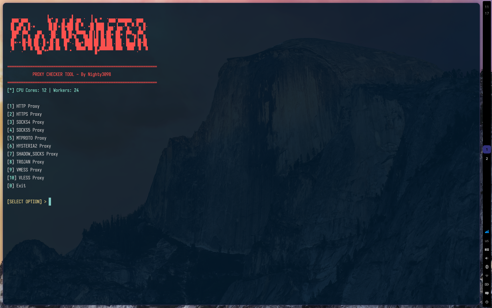
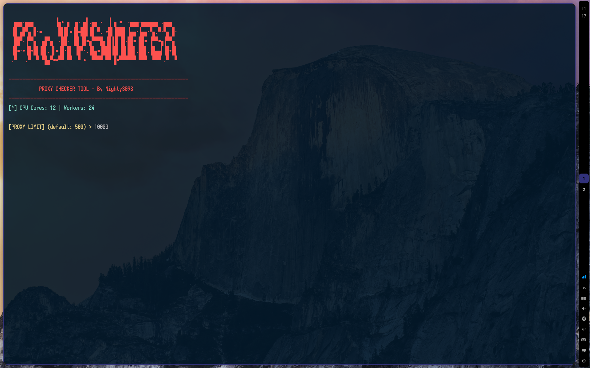
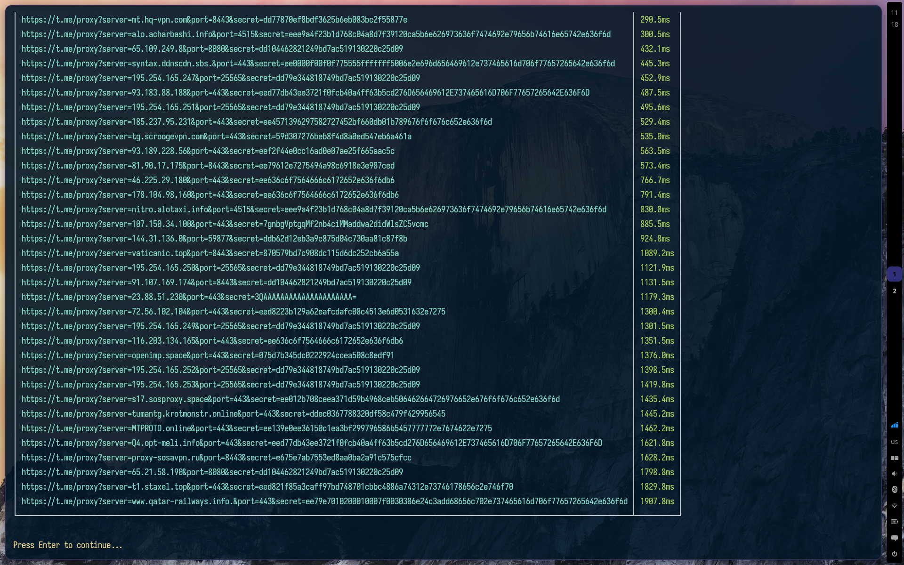

# ProxySniffer


<div width="70%" align="left">

<br />
<br />

Testing and sorting proxies by speed. Supports HTTP, HTTPS, SOCKS4, SOCKS5, VLESS, VMESS, Trojan, Hysteria2, ShadowSocks, MTProto.

</div>

<br />
<br />
<br />







## Features

- Load proxy lists from multiple sources
- Asynchronous multi-threaded testing
- Supported protocols: HTTP, HTTPS, SOCKS4, SOCKS5, VLESS, VMESS, Trojan, Hysteria2, ShadowSocks, MTProto
- Automatic detection of CPU core count
- Output working proxies sorted by speed
- Save results to a file

## Requirements

- Python 3.9+
- Linux (tested on Ubuntu/Debian)
- sing-box binary (for testing VLESS/VMESS/Trojan/Hysteria2/SS)

## Installation

### Quick Start (auto-installer)

```bash
git clone https://github.com/He6vyL0v3/ProxySniffer
cd ProxySniffer
./setup.sh
```

### Manual Installation

#### 1. Clone the repository

```bash
git clone https://github.com/He6vyL0v3/ProxySniffer
cd ProxySniffer
```

#### 2. Install Python dependencies

```bash
pip install -r requirements.txt
```

#### 3. Download sing-box

```bash
mkdir -p /tmp/sing-box-1.13.4-linux-amd64
cd /tmp/sing-box-1.13.4-linux-amd64
wget -q https://github.com/SagerNet/sing-box/releases/download/v1.13.4/sing-box-1.13.4-linux-amd64.tar.gz
tar -xzf sing-box-1.13.4-linux-amd64.tar.gz
mv sing-box-1.13.4-linux-amd64 sing-box
chmod +x sing-box
```

#### 4. Run

```bash
cd src
python3 main.py
```

## Usage

```
=================================================================
           PROXY CHECKER TOOL - By Nighty3098
=================================================================
[*] CPU Cores: 12 | Workers: 24

[1] HTTP Proxy
[2] HTTPS Proxy
[3] SOCKS4 Proxy
[4] SOCKS5 Proxy
[5] MTPROTO Proxy
[6] HYSTERIA2 Proxy
[7] SHADOW_SOCKS Proxy
[8] TROJAN Proxy
[9] VMESS Proxy
[10] VLESS Proxy
[0] Exit

[SELECT OPTION] > 
```

Select the proxy type (1-10) and specify the number of proxies to test.

### Default Limits

- HTTP/HTTPS/SOCKS4/SOCKS5: 2000 proxies
- VLESS/VMESS/Trojan/Hysteria2/ShadowSocks/MTProto: 500 proxies

### Recommended Settings

For HTTP/SOCKS proxies, it is recommended to test 1000-3000 proxies at a time.

For VLESS/VMESS/Trojan, do not exceed 500, as testing requires launching a separate sing-box process for each proxy.

## Project Structure

```
ProxySniffer/
├── src/
│   ├── main.py          # Main program file
│   └── links.py         # Proxy sources
├── requirements.txt     # Python dependencies
└── README.md           # This file
```

## Protocols and Testing Methods

| Protocol | Testing Method | Requires sing-box |
|----------|---------------|------------------|
| HTTP/HTTPS | aiohttp directly | No |
| SOCKS4/SOCKS5 | aiohttp via proxy | No |
| VLESS | sing-box | Yes |
| VMESS | sing-box | Yes |
| Trojan | sing-box | Yes |
| Hysteria2 | sing-box | Yes |
| ShadowSocks | sing-box | Yes |
| MTProto | TCP handshake | Partial |

## Troubleshooting

### Error "sing-box not found"

Make sure sing-box is installed at `/tmp/sing-box-1.13.4-linux-amd64/sing-box`

### Slow VLESS/VMESS Testing

This is normal - a separate sing-box process is started for each proxy. Limit the number of proxies to 500.

### HTTP Proxy Testing Not Working

```bash
# Check that the proxy works
curl -x http://IP:PORT https://httpbin.org/ip
```

## System Requirements

- Linux (tested on Ubuntu 20.04+)
- Python 3.9+
- Minimum 4 GB RAM for large proxy lists
- Recommended 8+ CPU cores for maximum speed
