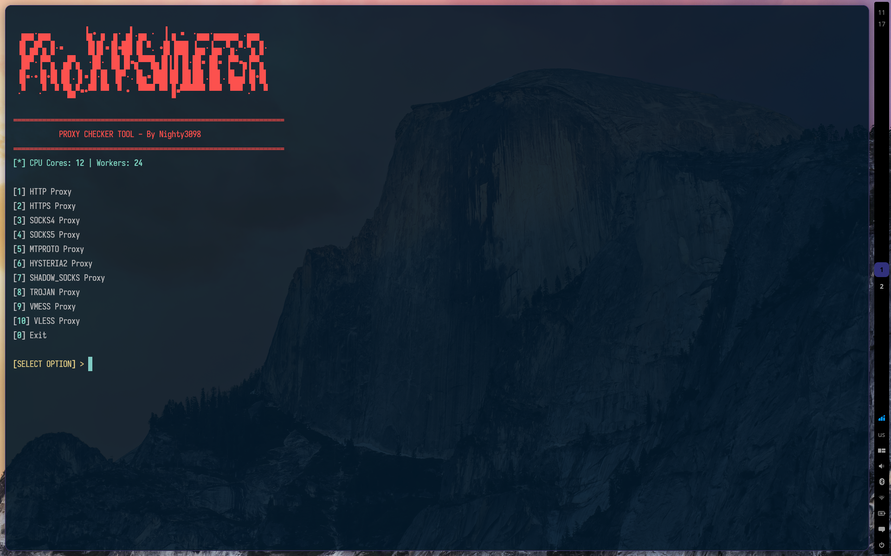
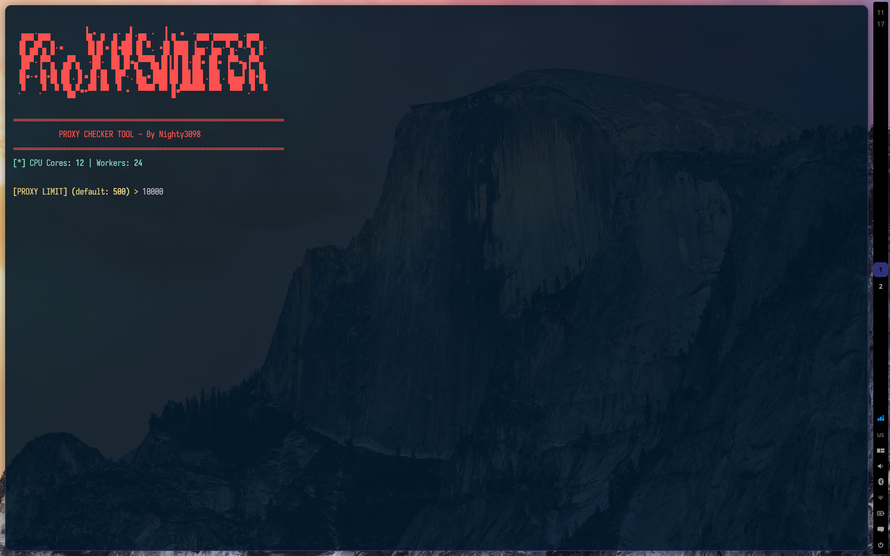
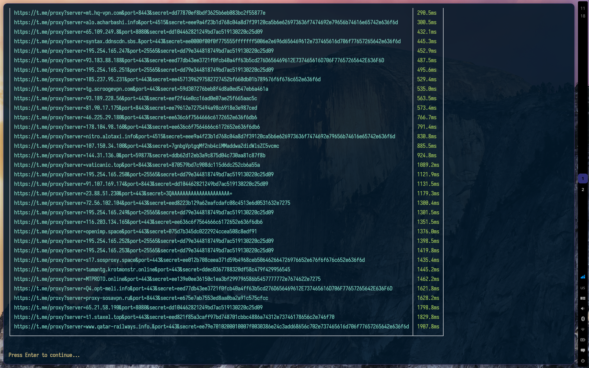

<div width="70%" align="left">

<br />

<h3>ProxySniffer</h3>

Testing and sorting proxies by speed. Supports HTTP, HTTPS, SOCKS4, SOCKS5, VLESS, VMESS, Trojan, Hysteria2, ShadowSocks, MTProto and Tor bridges (obfs4, webtunnel, snowflake).

</div>

<br />
<br />
<br />
<br />
<br />
<br />







## Features

- Load proxy lists from multiple sources
- Asynchronous multi-threaded testing
- Supported protocols: HTTP, HTTPS, SOCKS4, SOCKS5, VLESS, VMESS, Trojan, Hysteria2, ShadowSocks, MTProto, Tor bridges (obfs4/webtunnel/snowflake)
- Tor bridges are verified by a full Tor bootstrap to 100% (not just TCP)
- Automatic detection of CPU core count
- Output working proxies sorted by speed
- Save results to a file

## Requirements

- Python 3.9+
- Linux (tested on Arch/Ubuntu/Debian)
- sing-box binary (for testing VLESS/VMESS/Trojan/Hysteria2/SS, auto-installed by setup.sh)
- Tor Expert Bundle + lyrebird (for testing Tor bridges, auto-installed by setup.sh, Linux x86_64 only)
- snowflake-client binary (for testing snowflake bridges, auto-installed by setup.sh, Linux x86_64 only)

## Installation

### Quick Start (auto-installer)

```bash
git clone https://github.com/He6vyL0v3/ProxySniffer
cd ProxySniffer
./setup.sh
```

### Manual Installation

#### 1. Clone the repository

```bash
git clone https://github.com/He6vyL0v3/ProxySniffer
cd ProxySniffer
```

#### 2. Install Python dependencies

```bash
pip install -r requirements.txt
```

#### 3. Download sing-box

```bash
mkdir -p /tmp/sing-box-1.13.4-linux-amd64
cd /tmp/sing-box-1.13.4-linux-amd64
wget -q https://github.com/SagerNet/sing-box/releases/download/v1.13.4/sing-box-1.13.4-linux-amd64.tar.gz -O sing-box.tar.gz
tar -xzf sing-box.tar.gz
mv sing-box-1.13.4-linux-amd64/sing-box ./sing-box
chmod +x ./sing-box
rm sing-box.tar.gz
```

#### 4. Download Tor Expert Bundle (for Tor bridge testing, Linux x86_64)

```bash
TOR_BUNDLE_VERSION="15.0.23"
cd /tmp
curl -fL -o tor-expert-bundle.tar.gz "https://dist.torproject.org/torbrowser/${TOR_BUNDLE_VERSION}/tor-expert-bundle-linux-x86_64-${TOR_BUNDLE_VERSION}.tar.gz"
mkdir -p "tor-expert-bundle-${TOR_BUNDLE_VERSION}-linux-x86_64/bundle"
tar -xzf tor-expert-bundle.tar.gz -C "tor-expert-bundle-${TOR_BUNDLE_VERSION}-linux-x86_64/bundle" tor data docs
```

The checker expects `tor-client` wrapper + `tor/pluggable_transports/lyrebird` inside that directory (setup.sh creates the wrapper automatically).

#### 5. Download snowflake-client (for snowflake bridge testing, Linux x86_64)

```bash
mkdir -p /tmp/snowflake-2.14.1-linux-x86_64
curl -fL -o /tmp/snowflake-2.14.1-linux-x86_64/snowflake-client \
  https://archive.torproject.org/tor-package-archive/snowflake/2.14.1/client_linux_amd64
chmod +x /tmp/snowflake-2.14.1-linux-x86_64/snowflake-client
```

Alternatively install it from your distro: `sudo apt install snowflake-client` (the checker looks in `/usr/bin` first).

> Note: binaries under `/tmp` are wiped on reboot — just re-run `./setup.sh` to restore them.

#### 6. Run

```bash
cd src
python3 main.py
```

## Usage

```
=================================================================
           PROXY CHECKER TOOL - By Nighty3098
=================================================================
[*] CPU Cores: 12 | Workers: 24

[1] HTTP Proxy
[2] HTTPS Proxy
[3] SOCKS4 Proxy
[4] SOCKS5 Proxy
[5] MTPROTO Proxy
[6] HYSTERIA2 Proxy
[7] SHADOW_SOCKS Proxy
[8] TROJAN Proxy
[9] VMESS Proxy
[10] VLESS Proxy
[11] TOR OBFS4 Proxy
[12] TOR WEBTUNNEL Proxy
[13] TOR SNOWFLAKE Proxy
[0] Exit

[SELECT OPTION] >
```

Select the proxy type (1-13) and specify the number of proxies to test.

### Default Limits

- HTTP/HTTPS/SOCKS4/SOCKS5: 2000 proxies
- VLESS/VMESS/Trojan/Hysteria2/ShadowSocks/MTProto: 500 proxies
- TOR_OBFS4/TOR_WEBTUNNEL/TOR_SNOWFLAKE: 100 bridges

### Recommended Settings

For HTTP/SOCKS proxies, it is recommended to test 1000-3000 proxies at a time.

For VLESS/VMESS/Trojan, do not exceed 500, as testing requires launching a separate sing-box process for each proxy.

For Tor bridges, do not exceed 100: each bridge launches a separate `tor` process that bootstraps to 100% (up to 90s per bridge, max 4 in parallel). 100 bridges can take ~35 minutes in the worst case.

## GUI Mode

ProxySniffer also has a graphical interface using CustomTkinter.

### Run GUI

```bash
cd src
python3 main_gui.py
```

### GUI Features

- Modern dark/light theme (follows system settings)
- All 13 protocols supported (including Tor bridges)
- Real-time progress bar with ETA
- Scrolling log with live proxy check results
- Results table sorted by speed
- One-click save to file

## Project Structure

```
ProxySniffer/
├── src/
│   ├── main.py          # CLI entry point
│   ├── main_gui.py      # GUI entry point
│   ├── config.py        # Configuration
│   ├── core.py          # Core checking logic
│   ├── checker.py       # Protocol checkers
│   ├── fetcher.py       # Proxy downloader
│   ├── parsers.py       # Link parsers
│   ├── links.py         # Proxy sources
│   └── utils.py         # Utilities
├── requirements.txt     # Python dependencies
└── README.md           # This file
```

## Protocols and Testing Methods

| Protocol      | Testing Method                                  | Requires               |
| ------------- | ----------------------------------------------- | ---------------------- |
| HTTP/HTTPS    | aiohttp directly                                | No                     |
| SOCKS4/SOCKS5 | aiohttp via proxy                               | No                     |
| VLESS         | sing-box                                        | sing-box               |
| VMESS         | sing-box                                        | sing-box               |
| Trojan        | sing-box                                        | sing-box               |
| Hysteria2     | sing-box                                        | sing-box               |
| ShadowSocks   | sing-box                                        | sing-box               |
| MTProto       | TCP handshake                                   | Partial                |
| TOR_OBFS4     | full Tor bootstrap to 100% (TCP precheck first) | tor + lyrebird         |
| TOR_WEBTUNNEL | full Tor bootstrap to 100% (TCP precheck first) | tor + lyrebird         |
| TOR_SNOWFLAKE | full Tor bootstrap to 100%                      | tor + snowflake-client |

## Troubleshooting

### Error "sing-box not found"

Make sure sing-box is installed at `/tmp/sing-box-1.13.4-linux-amd64/sing-box`

### Slow VLESS/VMESS Testing

This is normal - a separate sing-box process is started for each proxy. Limit the number of proxies to 500.

### Error "tor not found" / "lyrebird not found"

Run `./setup.sh` — it downloads the Tor Expert Bundle (Linux x86_64) to `/tmp/tor-expert-bundle-15.0.23-linux-x86_64`.

### Error "snowflake-client not found"

Run `./setup.sh` (downloads the official Tor Project build), or install it from your distro: `sudo apt install snowflake-client`.

### Slow Tor bridge testing

This is normal - each bridge launches a separate `tor` process that bootstraps the whole Tor circuit up to 100% (up to 90s per bridge, max 4 in parallel). Dead IPs are skipped by a fast TCP precheck (~1.5s), but a full list of 100 bridges can still take tens of minutes.

### HTTP Proxy Testing Not Working

```bash
# Check that the proxy works
curl -x http://IP:PORT https://httpbin.org/ip
```
